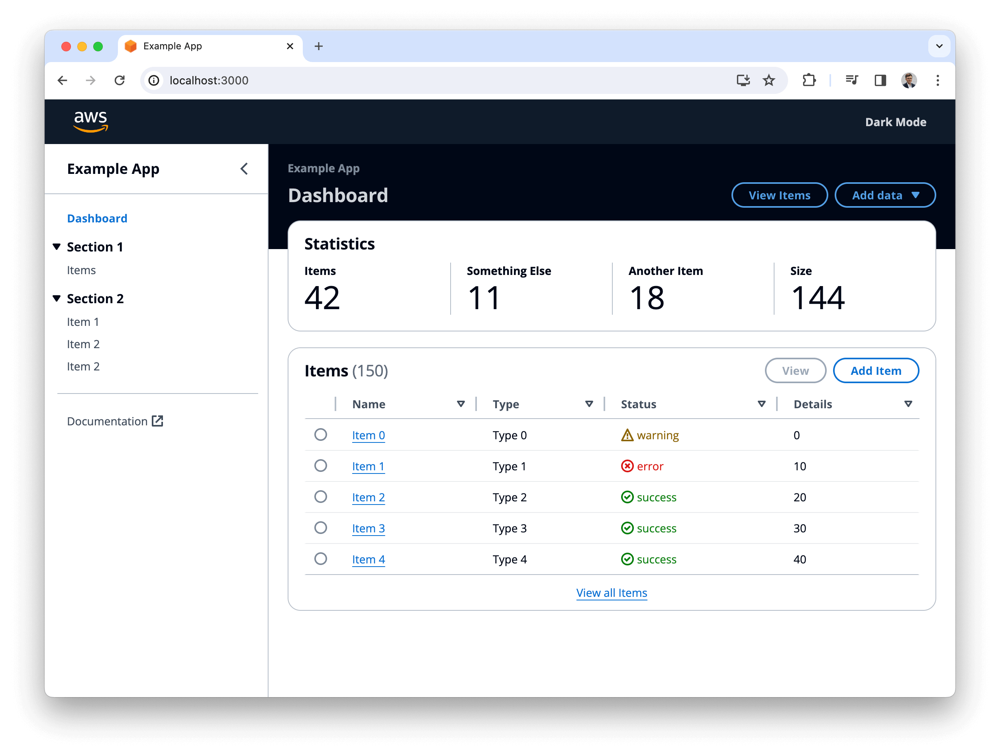
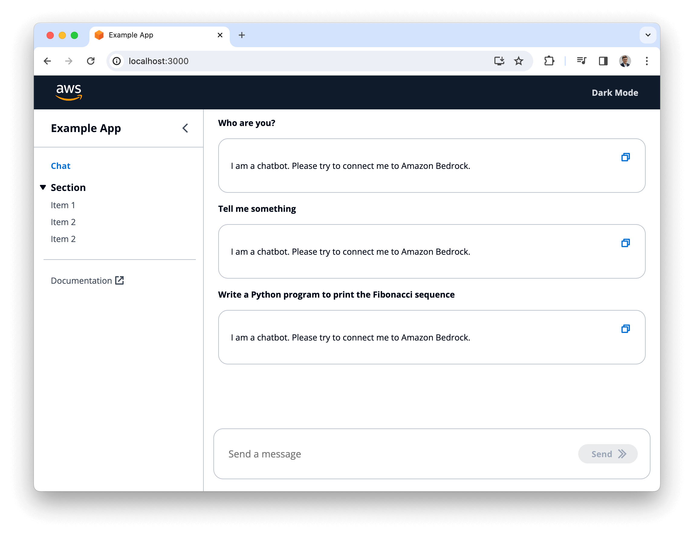

# Cloudscape Examples

[https://cloudscape.design/](https://cloudscape.design/)

Cloudscape is an open source design system for the cloud. Cloudscape offers user interface guidelines, front-end components, design resources, and development tools for building intuitive, engaging, and inclusive user experiences at scale.

This repository provides ready-to-use examples of Cloudscape React projects.

# Examples

|Name|Description|Framework|Languages|
|:-------------|:-------------|:-------------|:-------------|
|[Empty Cloudscape app](empty-vite) | Cloudscape example built with React Router and Vite. | React | TypeScript|
|[Basic Cloudscape app](basic-vite) | Cloudscape example built with React Router and Vite, featuring a dashboard page, a table page, details page, and an add page. | React | TypeScript|
|[Fullstack Cloudscape app with CDK and Cognito auth](fullstack-vite-cdk-cognito-auth) | Cloudscape fullstack example built with React Router and Vite, featuring a dashboard page, a table page, details page, and an add page. It is deployable with AWS CDK (Cloud Development Kit). The example deploys the frontend as a static website to an S3 bucket and serves it with Amazon CloudFront. It utilizes Amazon Cognito for authentication and Amplify UI for React for the login user interface. Data is stored in Amazon DynamoDB. The REST API is implemented with Amazon API Gateway and AWS Lambda and uses Powertools for AWS Lambda. | React, CDK | TypeScript, Python|
| [Chat UI for Cloudscape](chat-ui-vite) | Cloudscape example featuring a Chat UI, with a message input field and a list of messages. | React | TypeScript|

# License

This library is licensed under the MIT-0 License. See the LICENSE file.

- [License](LICENSE) of the project.
- [Code of Conduct](CODE_OF_CONDUCT.md) of the project.
- [CONTRIBUTING](CONTRIBUTING.md#security-issue-notifications) for more information.

# Legal Disclaimer

You should consider doing your own independent assessment before using the content in this repository for production purposes. This may include (amongst other things) testing, securing, and optimizing the content provided in this repository, based on your specific quality control practices and standards.