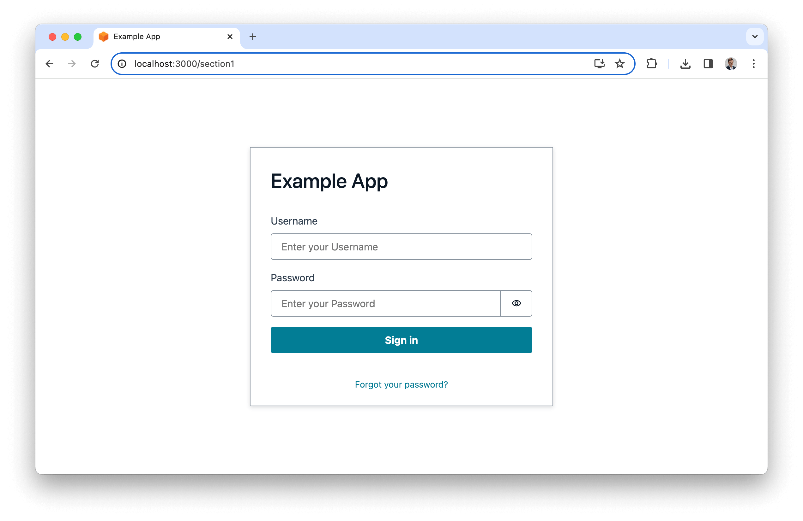
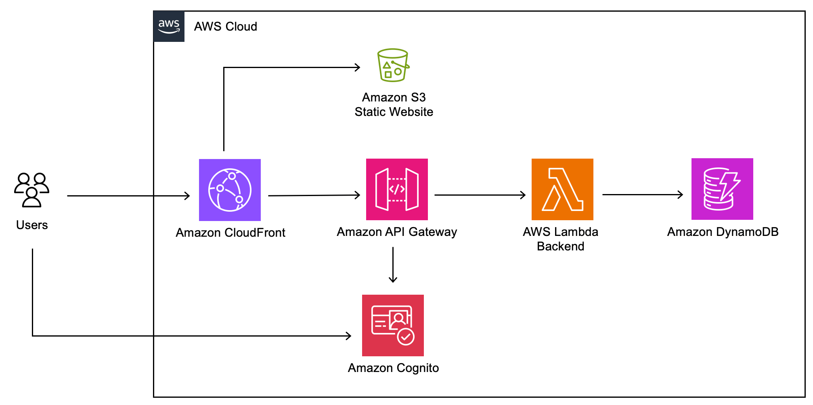
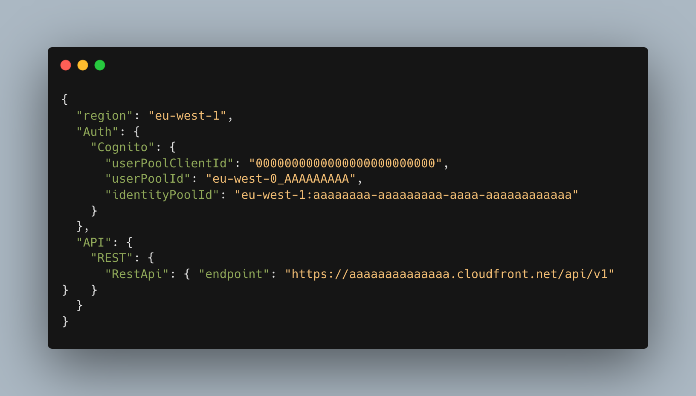

# Fullstack Cloudscape App with CDK and Cognito Auth

[https://cloudscape.design/](https://cloudscape.design/)

Cloudscape is an open source design system for the cloud. Cloudscape offers user interface guidelines, front-end components, design resources, and development tools for building intuitive, engaging, and inclusive user experiences at scale.





# Architecture



## Vite.js

[https://vitejs.dev/](https://vitejs.dev/)

Vite.js is a modern, fast front-end build tool that significantly improves the developer experience when building web applications. 

# Deploy
### Environment setup

#### Deploy with AWS Cloud9
We recommend deploying with [AWS Cloud9](https://aws.amazon.com/cloud9/). 
If you'd like to use Cloud9 to deploy the solution, you will need the following before proceeding:
- use `Amazon Linux 2023` as the platform.

#### Deploy with Github Codespaces
If you'd like to use [GitHub Codespaces](https://github.com/features/codespaces) to deploy the solution, you will need the following before proceeding:
1. An [AWS account](https://aws.amazon.com/premiumsupport/knowledge-center/create-and-activate-aws-account/)
2. An [IAM User](https://console.aws.amazon.com/iamv2/home?#/users/create) with:
  - `AdministratorAccess` policy granted to your user (for production, we recommend restricting access as needed)
  - Take note of `Access key` and `Secret access key`.

To get started, click on the button below.

[](https://codespaces.new/aws-samples/cloudscape-examples)

Once in the Codespaces terminal, set up the AWS Credentials by running

```shell
aws configure
```

```shell
AWS Access Key ID [None]: <the access key from the IAM user generated above>
AWS Secret Access Key [None]: <the secret access key from the IAM user generated above>
Default region name: <the region you plan to deploy the solution to>
Default output format: json
```

You are all set for deployment; you can now jump to [deployment](#deployment).

#### Local deployment
If you have decided not to use AWS Cloud9 or GitHub Codespaces, verify that your environment satisfies the following prerequisites:

You have:

1. An [AWS account](https://aws.amazon.com/premiumsupport/knowledge-center/create-and-activate-aws-account/)
2. `AdministratorAccess` policy granted to your AWS account (for production, we recommend restricting access as needed)
3. Both console and programmatic access
4. [NodeJS 20+](https://nodejs.org/en/download/) installed
    - If you are using [`nvm`](https://github.com/nvm-sh/nvm) you can run the following before proceeding
    - ```
      nvm install 20 && nvm use 20
      ```
5. [AWS CLI](https://aws.amazon.com/cli/) installed and configured to use with your AWS account
6. [Typescript 3.8+](https://www.typescriptlang.org/download) installed
7. [AWS CDK CLI](https://docs.aws.amazon.com/cdk/latest/guide/getting_started.html) installed
8. [Docker](https://docs.docker.com/get-docker/) installed
   - N.B. [`buildx`](https://github.com/docker/buildx) is also required. For Windows and macOS `buildx` [is included](https://github.com/docker/buildx#windows-and-macos) in [Docker Desktop](https://docs.docker.com/desktop/)

### Deployment

1. Clone the repository
```bash
git clone https://github.com/aws-samples/cloudscape-examples
```
2. Move into the cloned repository
```bash
cd cloudscape-examples/fullstack-vite-cdk-cognito-auth
```

<a id="deployment-dependencies-installation"></a>
3. Install the project dependencies by running this command
```bash
npm install
```

4. (Optional) Bootstrap AWS CDK on the target account and region

> **Note**: This is required if you have never used AWS CDK on this account and region combination. ([More information on CDK bootstrapping](https://docs.aws.amazon.com/cdk/latest/guide/cli.html#cli-bootstrap)).

```bash
npx cdk bootstrap aws://{targetAccountId}/{targetRegion}
```

You can now deploy by running:

```bash
npx cdk deploy
```
You can view the progress of your CDK deployment in the [CloudFormation console](https://console.aws.amazon.com/cloudformation/home) in the selected region.

5. Once deployed, take note of the `UserInterfaceDomainName` that use can use to access the app.

```bash
...
Outputs:
InfrastructureStack.UserInterfaceDomainName = https://dxxxxxxxxxxxxx.cloudfront.net
...
```

6. Create a user in Cognito to be able to access the app.


## Local Development
### Get aws-exports.json from the backend
Before you can connect to the backend from the local machine, you should deploy the backend part and then download the ``aws-exports.json`` file with the configuration parameters from the website.

```
https://dxxxxxxxxxxxxx.cloudfront.net/aws-exports.json
```


Save ``aws-exports.json`` file to `fullstack-vite-cdk-cognito-auth/user-interface/public` folder. 

### Run the App with backend access

1. Move into the user interface folder
```bash
cd user-interface
```
2. Install the project dependencies by running:
```bash
npm install
```
3. To start the development server, run:
```bash
npm run dev
```

This command will start a local development server at ``http://localhost:3000`` (or a different port if 3000 is in use). The server will hot-reload if you make edits to any of the source files.

